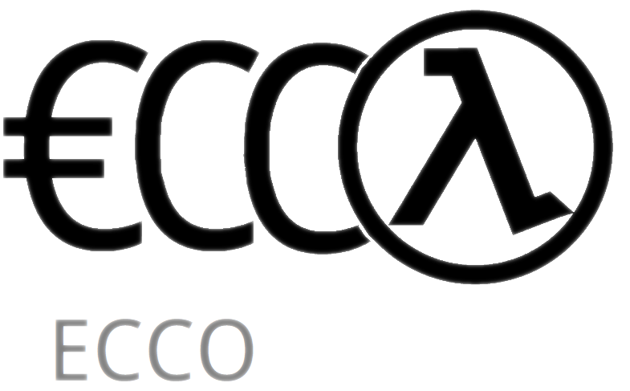
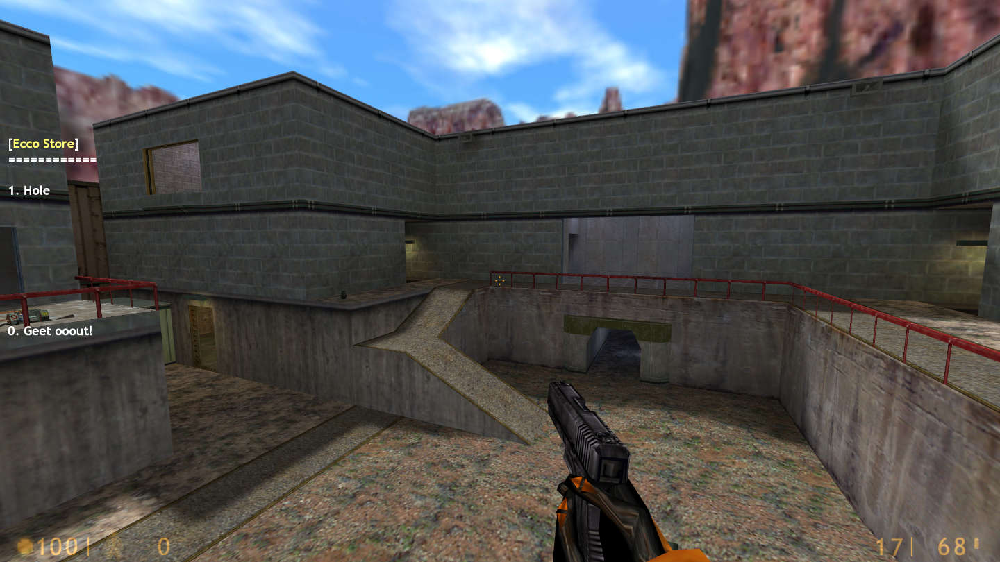
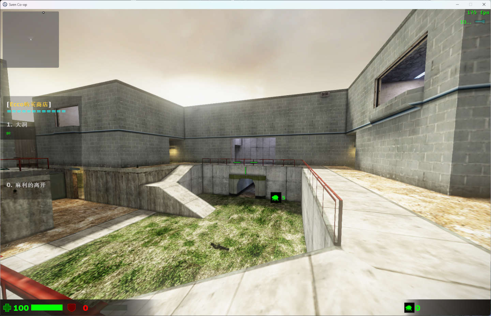

# `Ecco`: A complete Economy & Buy Menu Plugin 


Ecco is a complete economy & buy menu plugin mainly aimed Sven Co-op 5.x, It is designed to add many commands via toml files to purchase items from different plugins.

---


##  1. <a name='Install'></a>Install

1. install metamod-p or metamod-r or metamod-fallguys
2. grab ecco binary from action or release or build by yourslef
3. edit `(GAME_FOLDER)/addons/metamod/plugins.ini`
4. add 

``` ini

win32 addons/ecco/ecco.dll
linux addons/ecco/ecco.so

```

5. enjoy your new store :3

---

##  2. <a name='Build'></a>Build

If you are using systems that are not covered by automatic builds (yum's and aur's) 

or want to add new hooks yourself, you can follow these steps to configure your build environment.

1. Install everything you need
   
	

	1. [Git](https://git-scm.com/download/win) or `winget install --id Git.Git -e --source winget`
	2. [Visual Studio with vc143 toolset](https://visualstudio.microsoft.com/) And [C++ desktop development](https://learn.microsoft.com/en-us/cpp/ide/using-the-visual-studio-ide-for-cpp-desktop-development?view=msvc-170)

2. Exec scripts
	
	
	1. `./win_init.ps1`
	2. `./win_build.ps1`

	

	1. `./linux_init.sh`
	2. `./linux_build.sh`

	
# Yes, it works on Half-Life, but not very well



